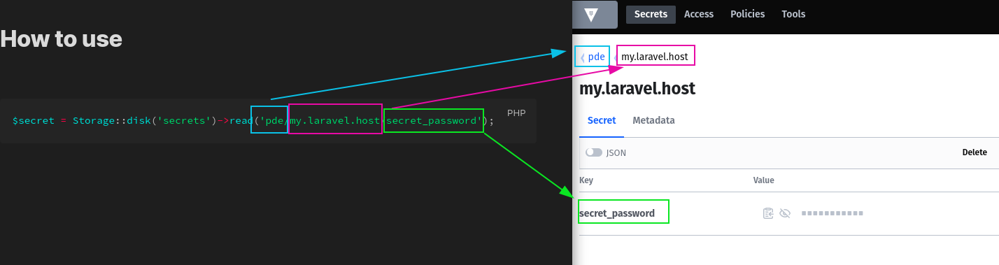

## Laravel Storage adapter for Hashicorp Vault

This is a utility library that allows reading Vault secrets using Laravel's `Storage` facade by creating a `vault` driver.

Note: this is a **read only** driver, you can only **read secrets** from vault. Create/Update/Delete is **unsupported** and will remain such.

## Why use this?

Saving secrets is a problem that's rarely solved correctly. Hashicorp's Vault is the software for secret management, from
usernames and passwords to saving private keys or having auto-rotating RDBMS credential management.2

Instead of saving sensitive data to environment variables, filesystems or coming up with your own scheme for handling it, using Vault is better choice.2
Vault, in turn, requires you to understand its API, caching, handling etc.

This library makes it easy for Laravel devs to utilize vault while learning the basics at their own pace.

The image below indicates how to think about paths in Vault and how to obtain data. You can insert the data into Vault using Vault's UI as this
library exposes only reading capabilities.

## Installation

1. `composer require just-some-code/flysystem-vault`

2. Publish config file via `php artisan vendor:publish --tag=config `

If you don't publish config, values are taken from .env/environment.

## Configuration

Available values

```php
<?php

return [
    'uri' => env('VAULT_URI'),
    'auth_strategy' => env('VAULT_AUTH_STRATEGY', 'token'),
    'token' => env('VAULT_TOKEN'),
    'use_namespace' => env('VAULT_USE_NAMESPACE'),
    'namespace' => env('VAULT_DEFAULT_NAMESPACE'),
    'auth_strategies' => [
        'token' => [
            'token' => env('VAULT_AUTH_TOKEN')
        ],
        'userpass' => [
            'username' => env('VAULT_AUTH_USERNAME'),
            'password' => env('VAULT_AUTH_PASS')
        ],
        'approle' => [
            'id' => env('VAULT_AUTH_APPROLE_ID'),
            'secret' => env('VAULT_AUTH_APPROLE_SECRET')
        ]
    ]
];

```

Mandatory values:

 - `VAULT_URI`, example: `http://localhost:8200`
 - `VAULT_AUTH_STRATEGY`, values: `['userpass', 'token', 'approle]`. It's assumed you know what these are. If you don't, use `userpass`
 - `VAULT_AUTH_TOKEN`, token to use for authentication if auth strategy is `token`
 - `VAULT_AUTH_USERNAME` / `VAULT_AUTH_PASS` - username and password for authenticating against vault.

## Expose to Laravel's filesystem

Configure .env with the values specified in the section before.

Modify `config/filesystem.php` and add storage disk with driver `vault`.

```php
    'disks' => [

        // Config for vault
        'secrets' => [
            'driver' => 'vault'
        ]
    ],

```

## How to use

```php
$secret = Storage::disk('secrets')->read('hcv://authstack/sso.authstack.localhost/oauth2/server/signing_key_private');
```

## Rules for Vault paths

Anything you want to read from vault must start with `vault:`

Refer to image below for visual explanation of the path

